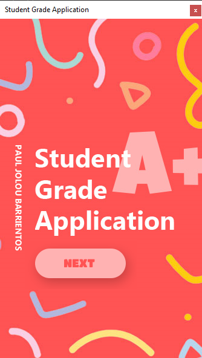
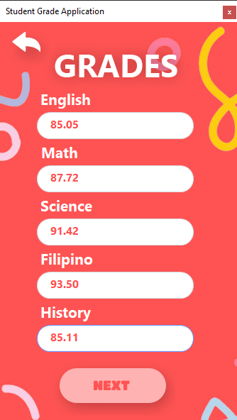
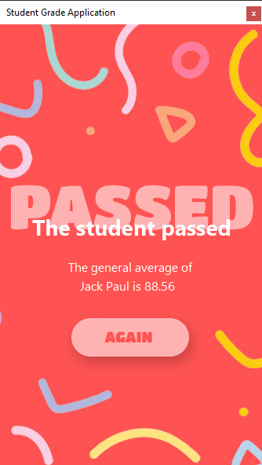

# Student Grade Application 💯
Simple C# Winform program that computes the average of five subjects (English, Math, Science, Filipino, and History) and determines whether you pass or fail. The program uses **.Net Framework version 4.6.1**.

## Screen Shot 📷

	
	
	
	

## Contribution 🔥

If you wish to help improve this project, fork this repo and submit your own pull request. If you discover a problem with this project, please report it to the issue page. Thank you very much 😊.

## Thank you 😃

If you like this project just click ⭐ and share it with others.
